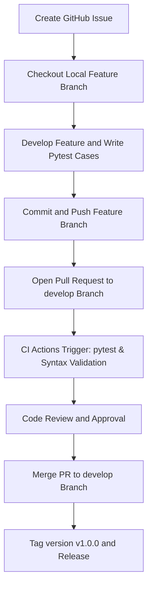

# 🏢 Employee Management System - Git & GitHub Curriculum Guide

This training guide is designed for fresh graduate engineers joining their first software development team. It walks you through **24 fundamental Git and GitHub exercises** step-by-step using a real-world project: the **Employee Management System**.

---

# 📚 Table of Exercises

1. [Git Installation & Configuration](#exercise-1-git-installation-and-configuration)
2. [Create Local Repository](#exercise-2-create-local-repository)
3. [Tracking Changes](#exercise-3-tracking-changes)
4. [Commit Best Practices](#exercise-4-commit-best-practices)
5. [Clone Existing Repository](#exercise-5-clone-existing-repository)
6. [Local vs GitHub Repository](#exercise-6-understanding-local-repository-vs-github-repository)
7. [Fetch, Pull, and Syncing](#exercise-7-understanding-fetch-pull-and-synchronizing-changes)
8. [Inspecting History](#exercise-8-inspecting-history)
9. [README and .gitignore Setup](#exercise-9-readme-and-gitignore-setup)
10. [Branching Basics](#exercise-10-branching-basics)
11. [Feature Branch Workflow](#exercise-11-feature-branch-workflow)
12. [Pull Request Creation](#exercise-12-pull-request-creation)
13. [Pull Request Reviews](#exercise-13-pull-request-reviews)
14. [Merge Conflict Creation and Resolution](#exercise-14-merge-conflict-creation-and-resolution)
15. [Rebase and Syncing with Main](#exercise-15-rebase-and-syncing-with-main)
16. [Issues, Labels, and Milestones](#exercise-16-issues-labels-and-milestones)
17. [Forking Workflow and Upstream Sync](#exercise-17-forking-workflow-and-upstream-synchronization)
18. [Advanced Git Operations (stash, reset, revert)](#exercise-18-advanced-git-operations-stash-reset-revert)
19. [History Investigation (blame and diff)](#exercise-19-history-investigation-blame-and-diff)
20. [GitHub Actions: Every Push Workflow](#exercise-20-github-actions--workflow-on-every-push)
21. [GitHub Actions: pytest CI Suite](#exercise-21-github-actions--automated-python-testing-using-pytest)
22. [GitHub Actions: Build Validation](#exercise-22-github-actions--build-validation-before-merge)
23. [Version Tagging & Releases](#exercise-23-version-tagging-and-github-releases)
24. [End-to-End Capstone Simulation](#exercise-24-end-to-end-capstone-workflow-simulation)

---

## Exercise 1: Git Installation and Configuration

### 1. Learning Objective
Install Git locally and configure your identity. Git uses this metadata to credit code contributions.

### 2. Industry Relevance
Software teams need to know exactly who authored each line of code for accountability, code reviews, and production support.

### 3. Step-by-Step Instructions
```bash
# Check if Git is installed
git --version

# Set global configurations
git config --global user.name "Siva"
git config --global user.email "siva@example.com"
git config --global init.defaultBranch main

# Verify configurations
git config --list
```

### 4. Verification Steps
Confirm your configuration parameters:
```bash
git config user.name   # Expected output: Siva
git config user.email  # Expected output: siva@example.com
```

### 5. Common Mistakes
* ❌ Using fake emails or name placeholders (which prevents GitHub from mapping commits to your profile).
* ❌ Typos in configuration parameters.

---

## Exercise 2: Create Local Repository

### 1. Learning Objective
Initialize a new local Git repository inside a project directory to start tracking file changes.

### 2. Industry Relevance
Every new project starts by creating a clean local workspace and initializing Git.

### 3. Step-by-Step Instructions
```bash
# Navigate to the project folder
cd /home/shiva/.gemini/antigravity/scratch/employee-management-system

# Initialize Git
git init
```

### 4. Verification Steps
Inspect your working directory. You should see a hidden `.git` folder created:
```bash
ls -la | grep "\.git"
# Expected output: drwxr-xr-x .git
```

---

## Exercise 3: Tracking Changes

### 1. Learning Objective
Understand the Git state lifecycle: Working Directory, Staging Area, and Committed state.

### 2. Industry Relevance
The staging area (`git add`) acts as a draft space where you prepare related changes before permanently recording them.

### 3. Step-by-Step Instructions
```bash
# Check current tracking status
git status

# Stage a file
git add README.md

# Stage all files in current folder
git add .
```

### 4. Expected Output
```text
On branch main
Changes to be staged:
  (use "git restore --staged <file>..." to unstage)
	new file:   README.md
	new file:   app.py
	new file:   employee_manager.py
...
```

---

## Exercise 4: Commit Best Practices

### 1. Learning Objective
Save staged snapshots to the local database with concise, standardized messages.

### 2. Industry Relevance
Modern software teams require semantic commit messages (e.g., conventional commits) to auto-generate changelogs and maintain a readable history.

### 3. Step-by-Step Instructions
Make 4 sequential commits:
```bash
# Commit 1: Setup README and Git Ignore
git add README.md .gitignore
git commit -m "docs: add project documentation and gitignore configuration"

# Commit 2: Main Business Logic
git add employee_manager.py employees.json requirements.txt
git commit -m "feat: implement JSON-based employee storage and CRUD logic"

# Commit 3: CLI App Interface
git add app.py
git commit -m "feat: add interactive command-line menu interface"

# Commit 4: Automated Testing
git add tests/
git commit -m "test: add pytest unit tests for employee manager"
```

### 4. Verification Steps
```bash
git log --oneline
```

---

## Exercise 5: Clone Existing Repository

### 1. Learning Objective
Download a copy of a remote GitHub repository to your local machine.

### 2. Industry Relevance
When you join a new project, your first action is cloning the team's repository to set up your local development workspace.

### 3. Step-by-Step Instructions
```bash
# Go to workspace parent directory
cd /home/shiva/.gemini/antigravity/scratch

# Clone your project into a temporary verification directory
git clone https://github.com/Siva9664/test_git_repo.git ems-verification
```

---

## Exercise 6: Understanding Local Repository vs GitHub Repository

### 1. Learning Objective
Differentiate between local workspaces (where edits happen) and remote repositories (central hub).

### 2. Industry Relevance
Git is a distributed version control system. Your local repository has a complete history copy, allowing you to commit code offline before pushing it online.

### 3. Step-by-Step Instructions
```bash
# Show local tracking branches and remote configuration
git remote -v
```

### 4. Expected Output
```text
origin	https://github.com/Siva9664/test_git_repo.git (fetch)
origin	https://github.com/Siva9664/test_git_repo.git (push)
```

---

## Exercise 7: Understanding Fetch, Pull, and Synchronizing Changes

### 1. Learning Objective
Retrieve remote updates using `git fetch` and safe merging with `git pull`.

### 2. Industry Relevance
Engineers pull team updates daily to prevent code drift and integration issues.

### 3. Step-by-Step Instructions
```bash
# Download remote changes without merging
git fetch origin

# Fetch and automatically merge remote changes
git pull origin main
```

---

## Exercise 8: Inspecting History

### 1. Learning Objective
Navigate repository history using `git log` filters, formatting, and options.

### 2. Industry Relevance
Debugging production regressions requires searching past commits to identify when a bug was introduced.

### 3. Step-by-Step Instructions
```bash
# Graphic view of history
git log --oneline --graph --all

# View changes made in the last 2 commits
git log -p -2
```

---

## Exercise 9: README and .gitignore Setup

### 1. Learning Objective
Configure a `.gitignore` to prevent tracking build artifacts, dependencies, and private configs.

### 2. Industry Relevance
Committing system files, dependency folders (like `node_modules` or virtual environments), or secrets (`.env`) poses significant security and maintainability risks.

### 3. Step-by-Step Instructions
Make sure `.gitignore` contains standard Python rules.
```bash
# View current .gitignore content
cat .gitignore
```

---

## Exercise 10: Branching Basics

### 1. Learning Objective
Create, list, switch, and delete local branches.

### 2. Industry Relevance
Branches isolate work, allowing developer teams to code features simultaneously without breaking the main codebase.

### 3. Step-by-Step Instructions
```bash
# Create develop branch
git branch develop

# Switch to develop
git checkout develop
```

---

## Exercise 11: Feature Branch Workflow

### 1. Learning Objective
Use feature branches to develop new enhancements, keeping `main` and `develop` clean.

### 2. Branching Strategy
* Feature branch: `feature/add-employee`
* Purpose: Add new features independently.

### 3. Step-by-Step Instructions
```bash
# Create feature branch
git checkout -b feature/add-employee

# Commit a small addition (e.g. comment or minor tweak)
echo "# Added feature marker" >> employee_manager.py
git add employee_manager.py
git commit -m "feat: add new feature comment marker"

# Switch back and merge to develop
git checkout develop
git merge feature/add-employee
```

---

## Exercise 12: Pull Request Creation

### 1. Learning Objective
Push a local branch to GitHub to open a Pull Request (PR) for integration.

### 2. Step-by-Step Instructions
```bash
# Push branch to remote origin
git push origin feature/add-employee
```

### 3. Pull Request Details Example
* **Title:** `feat: Add Employee Creation Feature`
* **Description:** Implements JSON serialization and ID auto-generation for new employee records.
* **Checklist:**
  - [x] Code reviewed locally
  - [x] All Pytest tests passed
  - [x] Added validation for empty names

---

## Exercise 13: Pull Request Reviews

### 1. Learning Objective
Comment on code, request changes, and approve pull requests on GitHub.

### 2. Industry Relevance
Code reviews ensure code quality, share knowledge, and catch bugs before deployment.

### 3. Verification Steps
* Go to the GitHub repository web interface.
* Create a PR from `develop` to `main`.
* Leave a comment on a line of code, approve the PR, and click merge.

---

## Exercise 14: Merge Conflict Creation and Resolution

### 1. Learning Objective
Simulate and resolve a merge conflict when two branches modify the same line in a file.

### 2. Step-by-Step Instructions
```bash
# Branch Conflict-A
git checkout develop
git checkout -b conflict-a
# Edit app.py to change the welcome message on line 58
# Change it to: print("\n🚀 Welcome to EMS v2.0 - A")
git add app.py
git commit -m "feat: Update title on conflict-a"

# Branch Conflict-B
git checkout develop
git checkout -b conflict-b
# Edit app.py to change the welcome message on line 58
# Change it to: print("\n🚀 Welcome to Employee Manager Pro - B")
git add app.py
git commit -m "feat: Update title on conflict-b"

# Merge Conflict-A into develop first
git checkout develop
git merge conflict-a

# Merge Conflict-B into develop (triggers conflict)
git merge conflict-b
```

### 3. Conflict Markers Explanation
In `app.py`, you will see:
```text
<<<<<<< HEAD
    print("\n🚀 Welcome to EMS v2.0 - A")
=======
    print("\n🚀 Welcome to Employee Manager Pro - B")
>>>>>>> conflict-b
```
* `HEAD` represents the current branch (`develop`).
* `conflict-b` represents the incoming branch.
* `=======` separates the conflicting versions.

### 4. Conflict Resolution Steps
* Edit `app.py` to keep the unified version:
  ```python
  print("\n🚀 Welcome to Employee Management System v2.0!")
  ```
* Remove the merge conflict markers.
* Stage the resolved file and commit:
```bash
git add app.py
git commit -m "fix: resolve merge conflict on app.py welcome title"
```

---

## Exercise 15: Rebase and Syncing with Main

### 1. Learning Objective
Rebase a feature branch on top of `develop` or `main` to maintain a clean history.

### 2. Industry Relevance
Rebasing avoids messy merge commits when updating local feature branches with team developments.

### 3. Step-by-Step Instructions
```bash
# Sync local tracking commits
git fetch origin

# Rebase feature branch on develop
git checkout feature/add-employee
git rebase develop
```

---

## Exercise 16: Issues, Labels, and Milestones

### 1. Learning Objective
Track tasks, bugs, and enhancements using GitHub Issues.

### 2. Enhancement/Bug Examples
* **Issue:** `Enhancement: Department Filter Feature`
* **Labels:** `enhancement`, `priority: medium`
* **Milestone:** `v1.0.0 - Release`

---

## Exercise 17: Forking Workflow and Upstream Synchronization

### 1. Learning Objective
Contribute to a repository using fork and sync workflows.

### 2. Step-by-Step Instructions
```bash
# Add upstream remote
git remote add upstream https://github.com/Siva9664/test_git_repo.git

# Sync fork with upstream main branch
git checkout main
git pull upstream main
```

---

## Exercise 18: Advanced Git Operations (Stash, Reset, Revert)

### 1. Learning Objective
Temporarily store work (`git stash`), rewrite local history (`git reset`), and safely undo public commits (`git revert`).

### 2. Step-by-Step Instructions
```bash
# 1. Stash temporary changes
git stash save "WIP: menu changes"
git stash pop

# 2. Reset local commit (revert last commit, keep changes staged)
git reset --soft HEAD~1

# 3. Revert a commit safely (creates a new counter-commit)
git revert HEAD --no-edit
```

---

## Exercise 19: History Investigation (Blame and Diff)

### 1. Learning Objective
Determine line-by-line authorship using `git blame` and compare branches with `git diff`.

### 2. Step-by-Step Instructions
```bash
# See authorship of each line in employee_manager.py
git blame employee_manager.py

# Diff main branch and feature branch
git diff main develop
```

---

## Exercise 20: GitHub Actions - Workflow on Every Push

### 1. Learning Objective
Automate actions on code push.

### 2. Workflow File
Saved to `.github/workflows/every-push.yml`:
```yaml
name: Continuous Integration - Trigger Notification

on:
  push:

jobs:
  notify:
    runs-on: ubuntu-latest
    steps:
      - name: Checkout Code
        uses: actions/checkout@v4

      - name: Display Success Message
        run: echo "Build triggered successfully! Repository checked out."
```

---

## Exercise 21: GitHub Actions - Automated Python Testing Using Pytest

### 1. Learning Objective
Set up automated tests to run on push and pull request activities.

### 2. Workflow File
Saved to `.github/workflows/pytest-ci.yml`:
```yaml
name: Continuous Integration - pytest Suite

on:
  push:
    branches: [ main, develop ]
  pull_request:
    branches: [ main, develop ]

jobs:
  test:
    runs-on: ubuntu-latest
    steps:
      - name: Checkout Code
        uses: actions/checkout@v4

      - name: Setup Python 3.11
        uses: actions/setup-python@v5
        with:
          python-version: "3.11"

      - name: Install dependencies
        run: |
          python -m pip install --upgrade pip
          if [ -f requirements.txt ]; then pip install -r requirements.txt; fi
          pip install pytest

      - name: Execute tests
        run: |
          pytest tests/ -v
```

---

## Exercise 22: GitHub Actions - Build Validation Before Merge

### 1. Learning Objective
Implement automated syntax and build validation checks for pull requests.

### 2. Workflow File
Saved to `.github/workflows/syntax-validation.yml`:
```yaml
name: Continuous Integration - Build & Syntax Validation

on:
  pull_request:
    branches: [ main, develop ]

jobs:
  validate:
    runs-on: ubuntu-latest
    steps:
      - name: Checkout Code
        uses: actions/checkout@v4

      - name: Setup Python
        uses: actions/setup-python@v5
        with:
          python-version: "3.11"

      - name: Validate Python Syntax
        run: |
          python -m py_compile app.py employee_manager.py
          echo "Syntax verification passed for app.py and employee_manager.py"
```

---

## Exercise 23: Version Tagging and GitHub Releases

### 1. Learning Objective
Tag a commit point with a semantic version number to create a release.

### 2. Step-by-Step Instructions
```bash
# Create annotated tag
git tag -a v1.0.0 -m "Release v1.0.0 - Initial MVP Release"

# Push tag to GitHub
git push origin v1.0.0
```

---

## Exercise 24: End-to-End Capstone Workflow Simulation

This simulates a full real-world feature lifecycle:



### Complete Sequence Command List
```bash
# 1. Create a feature branch
git checkout develop
git checkout -b feature/update-employee

# 2. Develop / Modify code (already done in codebase)

# 3. Stage and commit changes
git add employee_manager.py app.py tests/test_employee_manager.py
git commit -m "feat: complete JSON update employee implementation"

# 4. Push branch
git push origin feature/update-employee

# 5. Open Pull Request on GitHub, review, and merge to develop
# 6. Merge develop branch to main and tag release
git checkout main
git merge develop
git tag -a v1.0.0-final -m "Release v1.0.0 final"
git push origin v1.0.0-final
```
